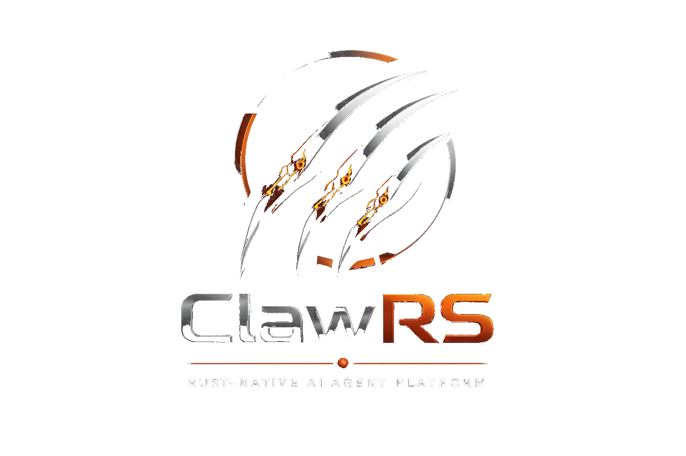
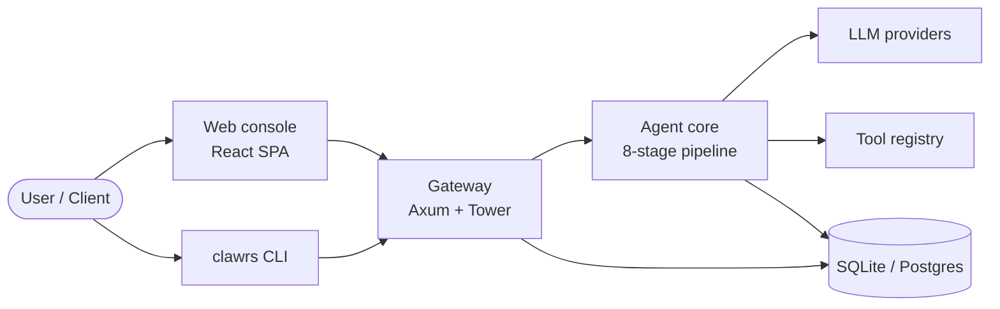
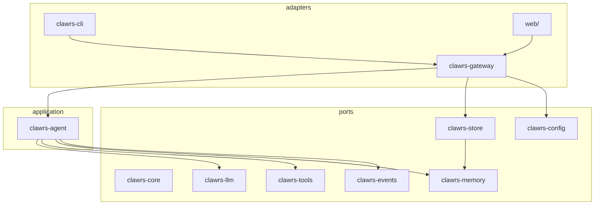
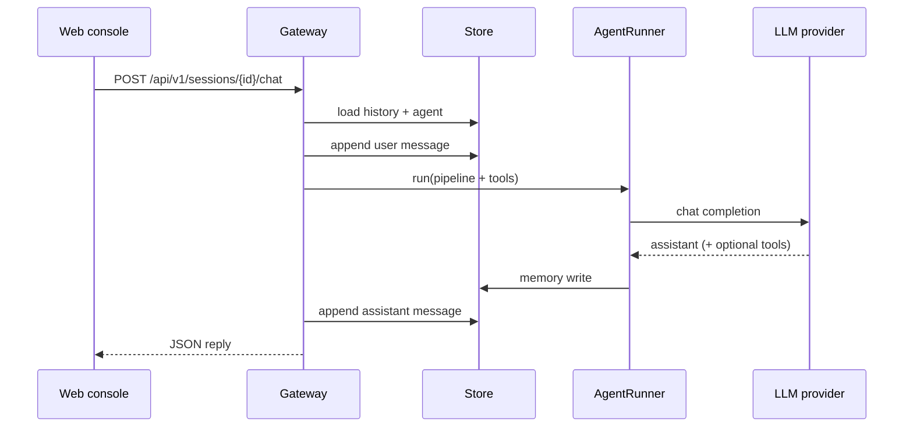
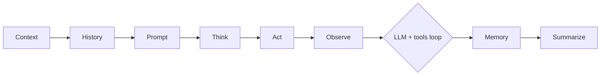

# ClawRS

<p align="center">
  <picture>
    <source media="(prefers-color-scheme: dark)" srcset="assets/logo.png" />
    
  </picture>
</p>

<p align="center">
  <strong>Rust-native AI agent platform</strong> — single binary, SQLite/Postgres persistence, OpenAI-compatible LLMs, tool loop, and a production web console.
</p>

Inspired by the *architecture* of [GoClaw](https://github.com/nextlevelbuilder/goclaw) (gateway, tiered memory, agent pipeline), **not** a port. ClawRS is engineered in Rust for safety, concurrency, and long-term modularity.

---

## Live

| Resource | URL |
|----------|-----|
| **Web console (GitHub Pages)** | [https://ayushkumarsingh09.github.io/ClawRS/](https://ayushkumarsingh09.github.io/ClawRS/) — **live API** when built with `VITE_API_BASE` (currently [clawrs-api.vercel.app](https://clawrs-api.vercel.app)); falls back to **demo mode** (local storage) if the API is unreachable. |
| **Repository** | [https://github.com/Ayushkumarsingh09/ClawRS](https://github.com/Ayushkumarsingh09/ClawRS) — full linear history is preserved on tag [`archive/full-history`](https://github.com/Ayushkumarsingh09/ClawRS/tree/archive/full-history) |
| **Live API (Vercel)** | [https://clawrs-api.vercel.app](https://clawrs-api.vercel.app) (`/health`, `/api/v1/…`) — gateway for GitHub Pages (`VITE_API_BASE`) |
| **Full stack (Docker)** | [Deploy to Render](https://render.com/deploy?repo=https://github.com/Ayushkumarsingh09/ClawRS) (free tier; add billing on Fly if using `fly.toml`) |

The Pages build reads the `VITE_API_BASE` repository variable ([Settings → Variables](https://github.com/Ayushkumarsingh09/ClawRS/settings/variables/actions)). Default production API: `https://clawrs-api.vercel.app`. For the Rust gateway on Render/Docker, point the variable at that URL instead.

---

## Highlights

| Area | What you get |
|------|----------------|
| **Runtime** | Tokio + Axum gateway, `clawrs` CLI, optional Docker image |
| **Agents** | 8-stage pipeline, tool rounds, prompt modes, pluggable LLM providers |
| **Data** | SQLx + SQLite by default (Postgres-ready schema path), sessions & messages persisted |
| **LLM** | Mock offline mode, or any OpenAI-compatible API (OpenAI, Groq, OpenRouter, Ollama, vLLM, …) |
| **UI** | React console (DM Sans / IBM Plex Mono, dark ClawRS branding) served from the same port |
| **Ops** | Health + status API, optional `CLAWRS_API_KEY`, structured tracing, GitHub Actions CI |

---

## Architecture

### System context



### Crate map (hexagonal)



### Agent turn (sequence)



### 8-stage pipeline



Stages before **Act** prepare messages; the **LLM ↔ tool** loop runs in the runner; **Memory** and **Summarize** run after a final assistant message.

---

## Quick start

### Prerequisites

- **Rust** stable ([rustup](https://rustup.rs))
- **Node.js** 20+ (for the web console build)
- **Windows:** [VS Build Tools](https://visualstudio.microsoft.com/visual-cpp-build-tools/) (C++) *or* GNU toolchain + MinGW `dlltool`

### Build & run (local)

```bash
# Backend
cargo build --release

# Web console
cd web && npm install && npm run build && cd ..

# Set an LLM key (optional — mock provider works without it)
export OPENAI_API_KEY=sk-...

# Serve API + UI on one port
cargo run -p clawrs-cli -- serve --listen 127.0.0.1:8787
```

Open **http://127.0.0.1:8787** — the gateway serves `web/dist` when present.

### Docker

```bash
docker compose up --build
# UI + API → http://localhost:8787
```

### CLI chat (no UI)

```bash
cargo run -p clawrs-cli -- chat "Hello from ClawRS"
```

---

## Configuration

| Variable | Default | Purpose |
|----------|---------|---------|
| `CLAWRS_LISTEN` | `127.0.0.1:8787` | HTTP bind address |
| `CLAWRS_DATABASE_URL` | `sqlite://clawrs.db?mode=rwc` | SQLx connection string |
| `CLAWRS_STATIC_DIR` | auto `web/dist` | Web console static files |
| `OPENAI_API_KEY` / `CLAWRS_OPENAI_API_KEY` | — | Enables real LLM provider |
| `CLAWRS_OPENAI_BASE_URL` | `https://api.openai.com` | OpenAI-compatible base URL |
| `CLAWRS_DEFAULT_MODEL` | `gpt-4o-mini` | Default model id |
| `CLAWRS_API_KEY` | — | If set, required on `/api/v1/*` (Bearer or `X-ClawRS-Key`) |

---

## HTTP API (v1)

| Method | Path | Description |
|--------|------|-------------|
| `GET` | `/health` | Liveness (no auth) |
| `GET` | `/api/v1/status` | Version, provider, counts |
| `GET/POST` | `/api/v1/agents` | List / create agents |
| `GET` | `/api/v1/agents/{id}` | Agent detail |
| `GET/POST` | `/api/v1/sessions?agent_id=` | List / create sessions |
| `GET` | `/api/v1/sessions/{id}/messages` | Chat history |
| `POST` | `/api/v1/sessions/{id}/chat` | Send message, run agent |

---

## Development

```bash
cargo test --workspace
cargo clippy --workspace --all-targets -- -D warnings

# Frontend dev server (proxies API to :8787)
cd web && npm run dev
```

See `docs/ROADMAP.md` for multi-tenant RBAC, NATS, Qdrant RAG, MCP, Tauri desktop, and SDK milestones.

---

## License

Apache-2.0 — see [LICENSE](LICENSE).
