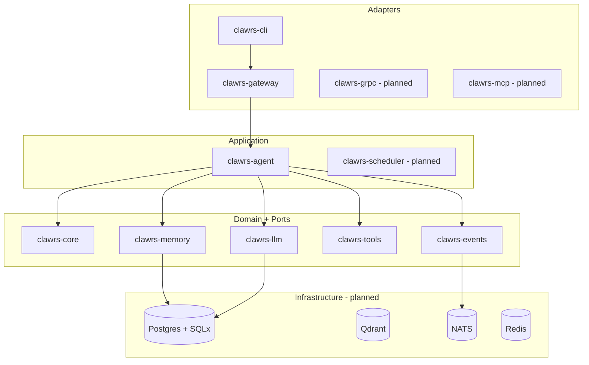

# ClawRS architecture overview

ClawRS follows **hexagonal (ports & adapters) architecture** with **DDD-style bounded contexts** mapped to Cargo crates. Cross-cutting concerns (tracing, metrics, auth) attach at the gateway and plugin boundaries—not inside domain cores.

## Layering

## Agent execution (M0)

Eight pluggable pipeline stages (context → history → prompt → think → act → observe → memory → summarize) wrap the **LLM ↔ tool loop**. Stages before the loop assemble context; stages after the loop compress memory.

Compared to GoClaw’s monolithic gateway, ClawRS keeps:

- **Stages** as independent `PipelineStage` implementations (testable, reorderable).
- **LLM** behind `LlmProvider` (mock, OpenAI-compatible, native Anthropic later).
- **Tools** behind `Tool` + `ToolRegistry` (plugins register at runtime).
- **Memory** behind `MemoryStore` (in-memory now; Postgres + Qdrant later).
- **Events** through `EventBus` (in-process broadcast now; NATS later).

## Multi-tenancy (planned M2)

`TenantContext` propagates from the gateway through agents, tools, and memory queries. Row-level isolation in Postgres and encrypted provider keys follow in the security crate.

## Design tradeoffs (M0)

| Choice | Benefit | Cost |
|--------|---------|------|
| Many small crates | Clear boundaries, parallel CI | More workspace boilerplate |
| In-memory adapters first | Fast iteration, hermetic tests | Not production persistence yet |
| OpenAI-compatible HTTP client | One adapter covers 15+ providers | Native APIs needed for caching/reasoning |
| Mock provider default | Zero-config dev UX | Production requires explicit provider config |

## Performance targets

Cold startup &lt;200ms and idle &lt;100MB are tracked from M1 onward via CI benchmarks on the `clawrs` binary (`crates/clawrs-cli`).
